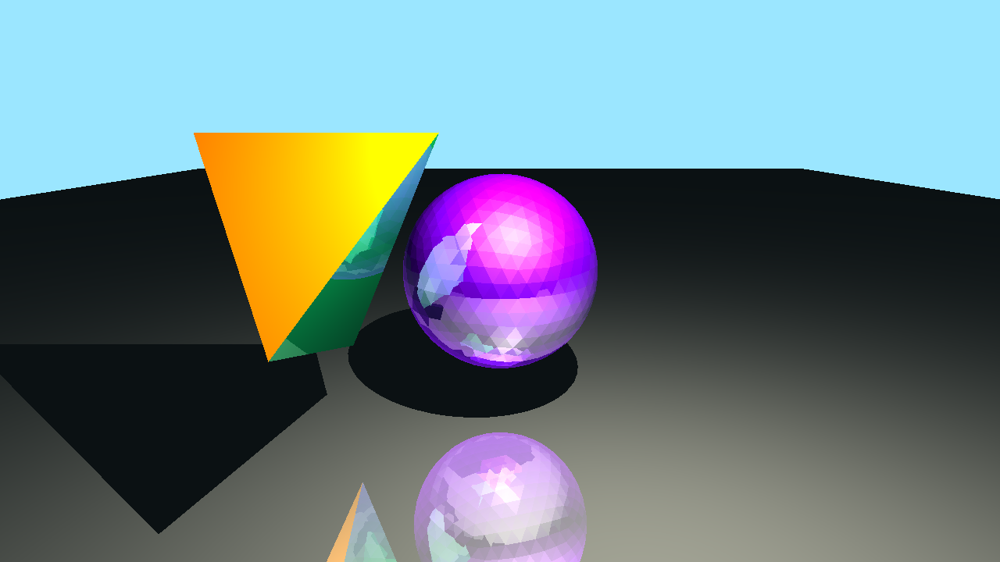

# Raytracer
A three dimensional raytracer written in C#

**Description:**
A renderer that creates a 3D image by tracing rays from the camera to the objects in the scene. This program is somewhat slow because of the large amount of calculations required to make an image and can be further optimized.

**Features:**
* Import STL files (ASCII format only)
* Custom colours and specular settings
* Recursive reflection
* Directional, point and spot lighting
* Perspective and orthographic camera
* Translate, scale and rotate objects
* AABB optimization
* Custom background lighting
* Ambient lighting
* Field of view and clipping